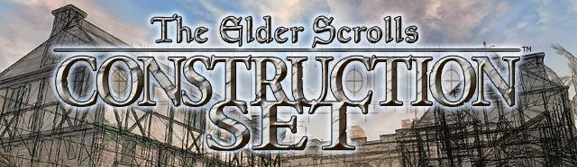

# [TES3CS Help Docs](https://tes3cs-manual.vercel.app/)

> _"The entire world is handcrafted by us - every dungeon, tree, rock and even flower has been given consideration to its location and relevance."_  
> \- Todd Howard[^1]

Preserved here for posterity are the original Morrowind Construction Set help documents.

Originally packaged with Morrowind as a WinHelp `.hlp` file, most users will now find they cannot open the Construction Set docs since Microsoft ended support for WinHelp from Windows 10 onward. The file is still packaged with new copies of Morrowind, but remains inaccessible without either [backwards-engineering WinHelp](https://github.com/knuth-konrad/winhlp32-on-windows10) to work on newer operating systems or [attempting to convert the file to a newer format](https://abitoftaste.altervista.org/morrowind/index.php?option=downloads&Itemid=50&task=info&id=78&-TES-Construction-Set-chm), the latter of which often results in a degraded version of the docs with a loss of both original formatting and functionality. Care has been taken here to recreate the documents as accurately and authentically as possible, with respect to the original content and text-formatting.

**The first page** of the original documents is **[The Elder Scrolls Construction Set](https://tes3cs-manual.vercel.app/getting-started/)** - perhaps you would like to start there? However, there are many ways you can explore this site, _"and the choice is yours."_

## Disclaimer

This is not a revised version of the TES3CS help documentation - it is a historical document presented verbatim\* for posterity's sake.

As the original text has been unaltered, it includes a number of errors, anachronisms and inconsistencies. These include:

- "Cell" is misspelled often (but not always) as "Cel" - this is merely a spelling error, not a technical distinctinction.
- Invented words are used, which are not sourced from or used in the context of TES lore, nor otherwise used as a canonical technical term by Bethesda anywhere else in the TES3CS docs (e.g., using "enchantings" instead of "enchantments")
- Language is occasionally gendered unnecessarily, referring to male pronouns instead of gender-neutral pronouns where the text is not only applicable to males.
- Some aspects of MWScript presented are inaccurate or outright incorrect.
	- _such as?_

\*Although the text is been preserved, the folder structure has been adjusted due to a large number of [uncategorized notes](https://tes3cs-manual.vercel.app/appendix#uncategorized-notes) which were otherwise difficult to find in the original TES3CS Help Docs.

## Ownership and Copyright

The Elder Scrolls, Morrowind, Tribunal, Bloodmoon, Bethesda Softworks, ZeniMax and their respective logos are registered trademarks or trademarks of ZeniMax Media Inc.

## Credits

- MassiveJuice and Greatness7 for converting and editing the docs to be hosted here.
- Morrowind Modding Wiki
- Knuth Konrad for their [winhlp32-on-windows10](https://github.com/knuth-konrad/winhlp32-on-windows10) guide to installing WinHelp on Windows 10/11.
- [HelpNDoc](https://www.helpndoc.com/), used to convert the `.hlp` file to Markdown files which were then edited to match the original docs as viewed in WinHelp
- [Obsidian.md](https://obsidian.md/), used to author the Markdown content
- [Quartz](https://quartz.jzhao.xyz/), used to build the site
- [Cloudflare](https://www.cloudflare.com/), for hosting

[^1]: ['TES CONSTRUCTION SET - WORLD BUILDING', elderscrolls.com, date saved: 2006-01-05, ](https://web.archive.org/web/20060105022248/http://www.elderscrolls.com/downloads/media_movies.htm)
